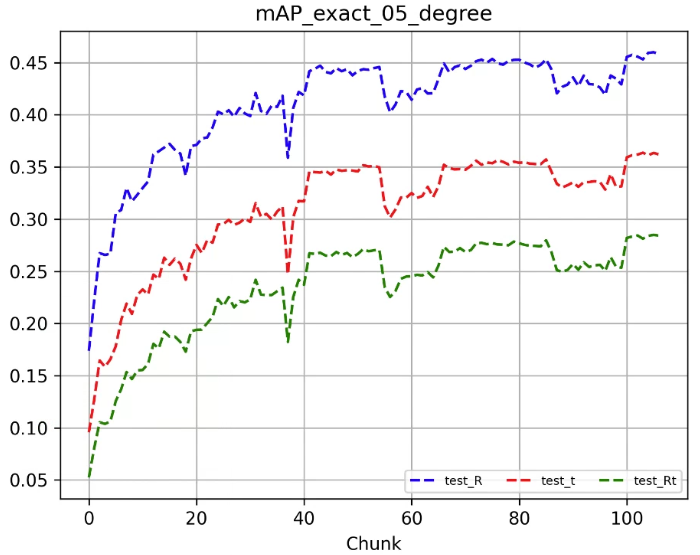

# A Novel One-To-One Framework for Relative Camera Pose Estimation

This repository contains the source code for the paper [**"A Novel One-To-One Framework for Relative Camera Pose Estimation"**](https://ieeexplore.ieee.org/abstract/document/10707240).
The experiments are conducted on Google Cloud Tensor Processing Units (TPUs) using [Pytorch XLA](https://github.com/pytorch/xla) library, and the work is supported by [TPU Research Cloud](https://sites.research.google/trc/about/).



This repo contains Python scripts from [OANET](https://github.com/zjhthu/OANet) repo.

The trained models can be downloaded from [here](https://drive.google.com/drive/folders/1j5z-FdzlgzZMB9qxcNyps2j61PjLYnqY?usp=sharing).


## Download OANET Repo and YFCC Dataset

Clone the [OANET](https://github.com/zjhthu/OANet) repo to your local machine.

Download [YFCC Dataset](https://drive.google.com/drive/folders/1xrc6ZuCOGYwno1DEIfK-jbvZGqK4Oc79) into cloned OANET folder.

Generate raw_data folder in cloned OANET folder with:
```
cat raw_data* > combined_file.tar.gz
tar -xvzf combined_file.tar.gz
```


## Generate .hdf5 Files

Generate .hdf5 Files using the scripts in OANET folder:
```
cd dump_match
python extract_feature.py
python yfcc.py
```
This may take a couple of hours.


## Generate pickle files from .hdf5 Files

Clone the current [one-to-one-framework-frcpe](https://github.com/mfatih7/one-to-one-framework-frcpe) repo to your local machine.

Generate a folder named `01_datasets` to the same directory level with the cloned `one-to-one-framework-frcpe` repo folder.

Copy previously generated `yfcc-sift-2000-train.hdf5`, `yfcc-sift-2000-val.hdf5`, and `yfcc-sift-2000-test.hdf5` files into `01_datasets` folder.

To generate pickle files, run

```
cd one-to-one-framework-frcpe
python convertHDF5toPickle.py
```

This may take a couple of hours.
The script generates 3 sets of pickle files.

For each of the train, validation, and test operations:
- 8 pickle files are generated for set 2,
- 4 pickle files are generated for set 1,
- 1 pickle file is generated for set 0.

The sets are proper for different TPU operations.

- Set 2 is proper for multi-core TPUv2 and TPUv3 operations.
- Set 1 is proper for multi-core TPUv4 operations.
- Set 0 is proper for SPMD and single-core operations.

For GPU operations, a set can be chosen with respect to the main memory capacity of the machine.


## Generate Google Cloud TPU Virtual Machine and Cloud Storage Bucket

Explore the [experiments.txt](https://drive.google.com/drive/folders/1j5z-FdzlgzZMB9qxcNyps2j61PjLYnqY?usp=sharing) to determine the TPU version you need.

Obtain a TPU Virtual Machine (TPU-VM) and Google Storage Bucket. Maybe [TPU Research Cloud](https://sites.research.google/trc/about/) can be helpful.

Numerous [publications](https://sites.research.google/trc/publications/) have been produced utilizing TPU chips.

To generate a TPU VM using Google Cloud CLI, the script [generate_tpu_vm.py](https://github.com/mfatih7/one-to-one-framework-frcpe/blob/main/tpu_related/generate_tpu_vm/generate_tpu_vm.py) can be used.


## Copy the Generated Dataset Folder into the Bucket

Copy the `01_datasets` folder into Bucket using the Bucket GUI or Google Cloud CLI.

You can also copy the folder into each TPU-VM, but Buckets are more manageable and storage-friendly.


## Clone This Repo into TPU-VM and Generate Python Environment

Clone this Repo into TPU-VM using:

```
git clone https://github.com/mfatih7/one-to-one-framework-frcpe.git
```

Use the script below to generate an environment in which all of the networks are trained in this study.

```
bash ~/one-to-one-framework-frcpe/tpu_related/initializer_tpu_vm/init_tpu_vm_nightly.sh
```

This environment (Python 3.8) does not have TPU-lowered implementations of [some functions](https://github.com/pytorch/xla/issues/6017).

Use the script below to generate a newer environment (with Python 3.10, nightly torch, torchvision, and torch_xla) that does not have lowering issues.

```
bash ~/one-to-one-framework-frcpe/tpu_related/initializer_tpu_vm/init_tpu_vm_nightly_latest.sh
```

Use the script below to generate a newer environment (with Python 3.10, stable torch, torchvision, and torch_xla) that does not have lowering issues.

```
bash ~/one-to-one-framework-frcpe/tpu_related/initializer_tpu_vm/init_tpu_vm_stable.sh
```

Be aware that [PyTorch/XLA](https://github.com/pytorch/xla) is still being developed, be careful about the updates.


## Local/Bucket Settings

If you copy data into the buckets, change [bucket_name](https://github.com/mfatih7/one-to-one-framework-frcpe/blob/main/config.py#L40-L54) with respect to the bucket you use.

If you copy data into TPU-VM, activate [input_data_storage_local_or_bucket](https://github.com/mfatih7/one-to-one-framework-frcpe/blob/main/config.py#L32-L33) local.


## Testing the Pre-Trained Models

Download pre-trained models from [here](https://drive.google.com/drive/folders/1j5z-FdzlgzZMB9qxcNyps2j61PjLYnqY?usp=sharing) and extract them.

Copy the extracted `08_outputs` folder to the same folder level as the `one-to-one-framework-frcpe` repo folder.

Select the [test operation](https://github.com/mfatih7/one-to-one-framework-frcpe/blob/main/config.py#L8-L9) in [config.py](https://github.com/mfatih7/one-to-one-framework-frcpe/blob/main/config.py).

Modify [experiment_no](https://github.com/mfatih7/one-to-one-framework-frcpe/blob/main/config.py#L63), [model_type, model_exp_no](https://github.com/mfatih7/one-to-one-framework-frcpe/blob/main/config.py#L65-L92) [operation, device](https://github.com/mfatih7/one-to-one-framework-frcpe/blob/main/config.py#L8-L17) in [config.py](https://github.com/mfatih7/one-to-one-framework-frcpe/blob/main/config.py) according to the preferences of pre-trained models in experiments.txt file in `08_outputs` folder.

Use [run_test_TPU.py](https://github.com/mfatih7/one-to-one-framework-frcpe/blob/main/run_test_TPU.py) for TPU tests and [run_test.py](https://github.com/mfatih7/one-to-one-framework-frcpe/blob/main/run_test_TPU.py) for GPU or CPU tests.

Use [run_find_best_test_checkpoint.py](https://github.com/mfatih7/one-to-one-framework-frcpe/blob/main/run_find_best_test_checkpoint.py) for mAP calculations.

Explore the results and plots in the `08_outputs` folder of the experiment you selected.


## Running Your Own Training Experiments

TPUv4 is sufficient for all model types.

Select [train operation](https://github.com/mfatih7/one-to-one-framework-frcpe/blob/main/config.py#L8-L9)

Modify [device](https://github.com/mfatih7/one-to-one-framework-frcpe/blob/main/config.py#L11-L17), [TPU type](https://github.com/mfatih7/one-to-one-framework-frcpe/blob/main/config.py#L35-L38), [data storage media](https://github.com/mfatih7/one-to-one-framework-frcpe/blob/main/config.py#L32-L33), [experiment_no](https://github.com/mfatih7/one-to-one-framework-frcpe/blob/main/config.py#L63), [model_type](https://github.com/mfatih7/one-to-one-framework-frcpe/blob/main/config.py#L65-L92), [side information usage](https://github.com/mfatih7/one-to-one-framework-frcpe/blob/main/config.py#L94-L95), [regression loss type](https://github.com/mfatih7/one-to-one-framework-frcpe/blob/main/config.py#L106-L107), [N_images_in_batch, N, batch_size, n_epochs and finish_epoch](https://github.com/mfatih7/one-to-one-framework-frcpe/blob/main/config.py#L133-L156)

Use [run_train_TPU.py](https://github.com/mfatih7/one-to-one-framework-frcpe/blob/main/run_train_TPU.py) for TPU trainings and [run_train.py](https://github.com/mfatih7/one-to-one-framework-frcpe/blob/main/run_test_TPU.py) for GPU or CPU trainings.

Explore the checkpoints and plots in the `08_outputs` folder of the experiment you selected.


## Testing Your Own Training Experiments

Make sure to reserve your selections in the training phase.

Select [test operation](https://github.com/mfatih7/one-to-one-framework-frcpe/blob/main/config.py#L8-L9)

Use [run_test_TPU.py](https://github.com/mfatih7/one-to-one-framework-frcpe/blob/main/run_test_TPU.py) for TPU tests and [run_test.py](https://github.com/mfatih7/one-to-one-framework-frcpe/blob/main/run_test_TPU.py) for GPU or CPU tests.

Use [run_find_best_test_checkpoint.py](https://github.com/mfatih7/one-to-one-framework-frcpe/blob/main/run_find_best_test_checkpoint.py) for mAP calculations.

Explore the results and plots in the `08_outputs` folder of the experiment you selected.

